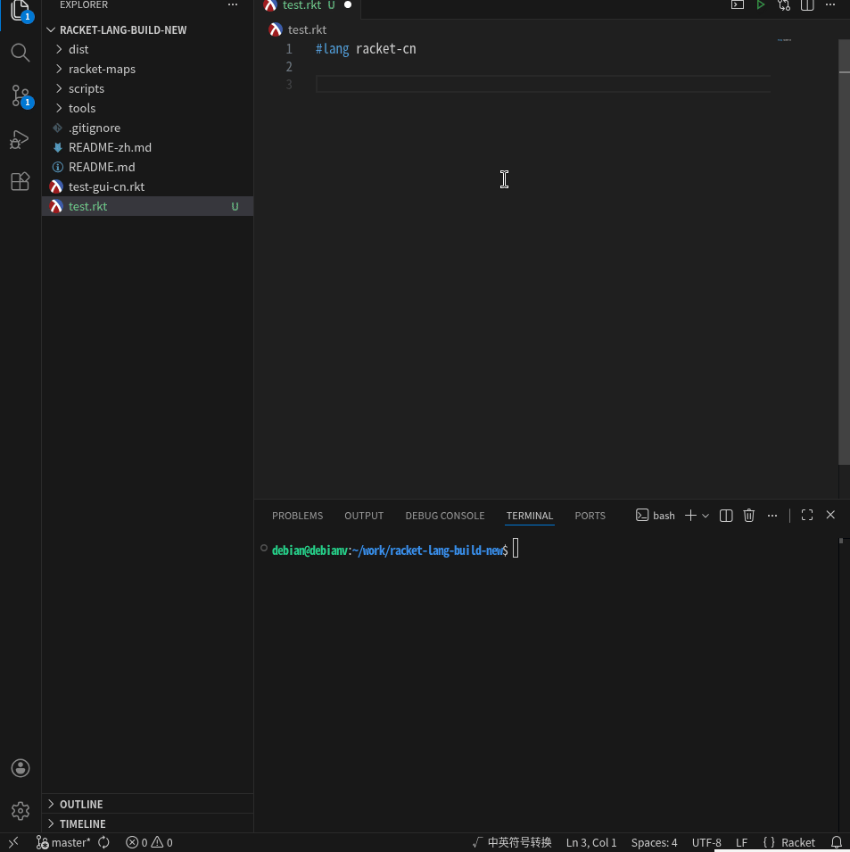

# racket-lang-build

A generic framework for building localized Racket language packages. Translate any Racket library into any language.



## Quick Start

```bash
# 1. Generate translation templates (scan modules + doc enum values)
./scripts/gen-racket.sh

# 2. Translate racket-maps/*.rkt (replace #f with translations)

# 3. Validate
racket tools/check/main.rkt --maps-dir racket-maps

# 4. Build language package + lang-server adapter
./scripts/build-racket-cn.sh

# 5. Install
raco pkg install --link dist/racket-cn
bash dist/lang-server/install.sh

# 6. Use
echo '#lang racket-cn
(定义 (阶乘 n)
  (如果 (< n 2) 1 (* n (阶乘 (- n 1)))))
(显示-行 (阶乘 10))' > test.rkt
racket test.rkt  # → 3628800
```

## Project Structure

```
tools/                              ← Pure tools, zero hardcoding
├── collect/                          Module scanning → translation templates
│   ├── main.rkt                        CLI + recursive traversal + --skip
│   ├── scan.rkt                        module->exports source tracking + dedup
│   └── writer.rkt                      Map file generation
├── collect-kw-vals/                  Extract keyword enum values from docs
│   └── main.rkt                        Scribble blueboxes query
├── check/                            Translation validation
│   └── main.rkt                        Missing / CN-conflict / EN-conflict
└── build/                            Build language package
    ├── main.rkt                        maps → tables + template filling
    └── templates/
        ├── reader.rkt                  #lang reader template
        ├── search-map.rkt              Translation lookup API
        ├── file-map.rkt                File conversion (preserves formatting)
        └── lang-server/                Language server adapter
            ├── translate.rkt             Table loading (no suffix matching)
            ├── doc.rkt                   Bilingual completion + smart insertText
            ├── doc-lang.rkt              #lang detection (~LANG-NAME~ matching)
            ├── interfaces.rkt            CompletionItem extensions
            └── install.sh               One-click install to racket-langserver

scripts/                            ← Racket-specific configuration
├── gen-racket.sh                     collect + kw-vals
├── build-racket-cn.sh                Build Chinese language package
├── build-racket-gui.sh               Scan gui-lib package
└── migrate-translations.rkt          Migrate translations from old maps
```

## Architecture

### Data Flow

```
Racket modules                       Scribble docs
     │                                    │
     ▼                                    ▼
  collect                           collect-kw-vals
 (module->exports                  (fetch-blueboxes-strs
  source tracking + dedup)          parse enum values)
     │                                    │
     ▼                                    ▼
  maps/*.rkt ──── translate ──── maps/*.rkt (with kw-value-map)
                                          │
                                    ▼           ▼
                                 check        build
                              (validate)  (maps → .rktd tables
                                           + reader + utilities
                                           + lang-server)
                                               │
                              ┌────────────────┼────────────────┐
                              ▼                                 ▼
                        dist/racket-cn/              dist/lang-server/
                        ├── main.rkt                 ├── translate.rkt
                        ├── search-map.rkt           ├── doc.rkt
                        ├── file-map.rkt             ├── install.sh
                        └── tables/                  └── ...
```

### Deduplication

Each map contains only symbols **defined in that module**. Symbols from other
modules are forwarded via `re-exports`:

```
racket/main  → 0 own + re-exports: 31 submodules (no duplicate translation)
racket/base  → 1641 own (all symbols translated here)
racket/list  → 67 own (list-specific symbols only)
racket/gui   → 0 own + re-exports: racket/gui/base, racket/main
```

For pkg-installed libraries, the package name prefix is automatically stripped:
`pkgs/gui-lib/racket/gui/base.rkt` → `racket/gui/base` (not `gui-lib/racket/gui/base`)

## Tool Reference

### collect

```bash
racket tools/collect/main.rkt \\
  --input-dir /usr/racket/collects \\
  --maps-dir racket-maps \\
  --skip private --skip compiled

# Scan pkg-installed libraries
./scripts/build-racket-gui.sh
```

`--skip` rules: without `/` matches basename, with `/` matches relative path.

### collect-kw-vals

```bash
racket tools/collect-kw-vals/main.rkt --maps-dir racket-maps
```

Appends `kw-value-map` to existing map files. Idempotent.

### check

```bash
racket tools/check/main.rkt --maps-dir racket-maps --report-dir racket-maps
```

Generates: `missing.rktd`, `conflict-cn.rktd`, `conflict-en.rktd`

### build

```bash
racket tools/build/main.rkt \\
  --lang racket-cn \\
  --base-lang racket \\
  --maps-dir racket-maps \\
  --output-dir dist/racket-cn \\
  --preload racket/main \\
  [--tables-dir path] \\
  [--lang-server-dir dist/lang-server] \\
  [--lang-server-tables "../racket-cn/tables"]
```

| Parameter | Description |
|-----------|-------------|
| `--lang` | Package name, determines `#lang` identifier |
| `--base-lang` | Underlying language, file-map #lang conversion target |
| `--maps-dir` | Translated maps directory |
| `--output-dir` | Output package directory |
| `--preload` | Default table to preload at startup |
| `--tables-dir` | Tables directory (default: output-dir/tables) |
| `--lang-server-dir` | Lang-server output directory (optional) |
| `--lang-server-tables` | Tables path for lang-server (optional) |

### Template Variables

| Placeholder | Source | Description |
|-------------|--------|-------------|
| `~LANG-NAME~` | `--lang` | Language package name |
| `~BASE-LANG~` | `--base-lang` | Underlying language |
| `~PRELOAD~` | `--preload` | Preload table path |
| `~TABLES-PATH~` | `--tables-dir` or `"tables"` | Tables lookup path |

## Generated Output

```
dist/
├── racket-cn/                     ← raco pkg install --link
│   ├── main.rkt                     #lang reader
│   ├── search-map.rkt               (map-> 'sym) / (map<- 'sym)
│   ├── file-map.rkt                 (map-file-> src dst) preserves formatting
│   ├── info.rkt
│   └── tables/                      .rktd translation tables
└── lang-server/                   ← install.sh → racket-langserver
    ├── translate.rkt                Scoped table loading, no suffix matching
    ├── doc.rkt                      Bilingual completion + smart insertText
    ├── doc-lang.rkt                 #lang exact matching
    ├── interfaces.rkt               insertText + DocumentSymbol
    └── install.sh                   Copy + raco setup
```

### Language Server

```
Completion popup:    定义 (define)
Type "def"  → insert: define     ← EN prefix match → insert English
Type "定"   → insert: 定义       ← no EN match → insert translated
Empty       → insert: 定义       ← default translated
```

insertText selection (language-agnostic, no character encoding detection):
```racket
(if (string-prefix? en left-fragment) en cn)
```

Install: `bash dist/lang-server/install.sh` (auto-detects racket-langserver location, or specify manually: `install.sh /path/to/racket-langserver`)

## Quick Commands

### Translate Files

```bash
# Chinese → English (preserves formatting, converts #lang)
racket -e '(require racket-cn/file-map) (map-file-> "src-cn.rkt" "out-en.rkt")'

# English → Chinese
racket -e '(require racket-cn/file-map) (map-file<- "src-en.rkt" "out-cn.rkt")'
```

### Look Up Translations

```bash
# CN → EN
racket -e '(require racket-cn/search-map) (displayln (map-> (quote 定义)))'
# → define

# EN → CN
racket -e '(require racket-cn/search-map) (displayln (map<- (quote define)))'
# → 定义

# Batch lookup
racket -e '(require racket-cn/search-map) (for-each (λ (s) (printf "~a → ~a\n" s (map<- s))) (list (quote define) (quote lambda) (quote if) (quote let)))'
```

### Use in REPL

```racket
> (require racket-cn/search-map)
> (map-> '显示-行)
'displayln
> (map<- 'displayln)
"显示-行"
```

## Extending to Other Languages

```bash
cat > scripts/build-racket-jp.sh << 'EOF'
racket tools/build/main.rkt \\
  --lang racket-jp --base-lang racket \\
  --maps-dir racket-maps-jp \\
  --output-dir dist/racket-jp \\
  --preload racket/main \\
  --lang-server-dir dist/lang-server-jp \\
  --lang-server-tables "../racket-jp/tables"
EOF
```

Tools are generic — only scripts and translations change.
`~LANG-NAME~` is substituted into all templates automatically.

## Extending to Other Libraries

```bash
# Scan pkg-installed libraries (e.g. gui-lib)
./scripts/build-racket-gui.sh

# Or scan any library
racket tools/collect/main.rkt \\
  --input-dir /usr/racket/share/pkgs/pict-lib \\
  --maps-dir racket-maps --skip private --skip compiled

# Translate, rebuild, reinstall
./scripts/build-racket-cn.sh
raco pkg install --link dist/racket-cn
```

`(require pict)` → reader loads `tables/pict/main.rktd` automatically.
Pkg re-export paths are normalized: `pkgs/[^/]+/(.+)` strips the package name.
